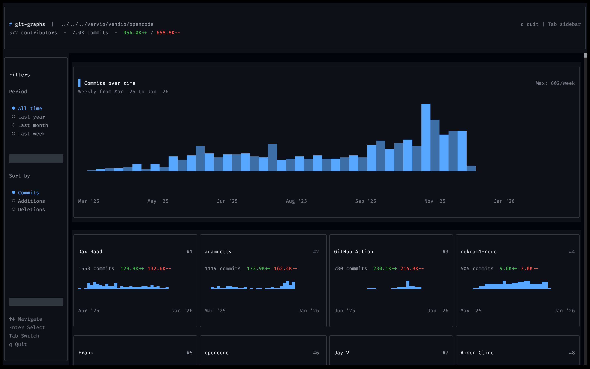

# git-graphs

GitHub-style contribution graphs for any local git repository — rendered as a fast, keyboard-first terminal UI (TUI).



## What it does

Given a repository path, `git-graphs`:

- Extracts commit history + per-commit `--numstat` (additions/deletions) from `git log`
- Buckets activity by week
- Deduplicates contributors (including GitHub `users.noreply.github.com` addresses)
- Renders:
  - A header with repo path + aggregated totals
  - A sidebar for **Period** and **Sort**
  - A "Commits over time" weekly bar chart
  - Contributor cards (ranked) with a mini sparkline

## Requirements

- **Bun** installed: https://bun.sh
- **git** available in PATH
- A target directory that is a valid git repository

## Install

```bash
bun install
```

## Run

From `git-graphs/`:

```bash
# Analyze current directory
bun run src/index.tsx

# Analyze a specific repo
bun run src/index.tsx /path/to/repo
```

### Watch mode (development)

`package.json` defines a watch script:

```bash
# Watch + analyze a specific repo
bun run dev ../../../vervio/vendio/ai-retail-agent
```

## Controls

Global:
- `q` / `Ctrl+C`: quit
- `Tab`: toggle focus between sidebar and main content

Sidebar (when focused):
- `↑/↓` or `k/j`: move selection
- `Enter` or `Space`: apply selection

## Filters

### Period

- **All time**: from the first commit date to the current date
- **Last year**
- **Last month**
- **Last week**

### Sort

Contributors can be sorted by:
- **Commits**
- **Additions**
- **Deletions**

## How it works (high-level)

1. `src/index.tsx` reads the repo path from `process.argv[2]` (defaults to `.`)
2. `src/git.ts` runs:
   - `git -C <repo> log --no-merges --format="%H|%an|%ae|%aI" --numstat`
3. Results are parsed into typed structures (`GitStats`, `WeeklyData`, `ContributorData`)
4. `src/index.tsx` applies:
   - period filtering
   - contributor aggregation + sorting
   - week padding for continuous chart timelines
5. UI components in `src/components/*` render the results via OpenTUI React

## Project structure

- `src/index.tsx` — entrypoint, state, keyboard handling, layout
- `src/git.ts` — git parsing + aggregation
- `src/components/`
  - `Header.tsx` — header summary
  - `Sidebar.tsx` — period/sort selection
  - `CommitsChart.tsx` — repo-wide chart
  - `ContributorCard.tsx` — per-contributor card + mini chart
  - `BarChart.tsx` — reusable chart primitives
- `src/keybinds/index.ts` — keybind config + matcher
- `src/theme/colors.ts` — centralized theme tokens

## Notes / limitations

- Stats can differ slightly from GitHub’s UI because GitHub has additional identity mapping and metadata not available locally.
- Repositories with very large histories can take longer to parse because `git log --numstat` is inherently heavy.

## Troubleshooting

### "Failed to load git stats" / exit code 128

- The provided path is not a git repo or is not accessible.

Quick check:

```bash
git -C /path/to/repo status
```

### Layout issues in narrow terminals

This app is a TUI and is sensitive to terminal width.
- Try widening your terminal.
- Some text is truncated intentionally to keep sections fixed-height.

## Built with

- OpenTUI
  - `@opentui/core`
  - `@opentui/react`
- React 19
- Bun

## Related docs

- OpenTUI: https://github.com/anomalyco/opentui
- create-tui: https://git.new/create-tui

---

For LLM agents working on this repo, see [`AGENTS.md`](./AGENTS.md).
